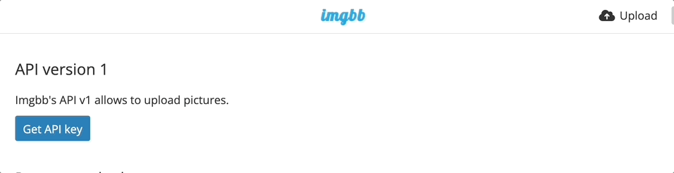

# Enabling image uploads

LogLink handles text, urls and locations out of the box. It can also happily deal with images (which is really nice if you want to snap a photo of something and have it sync directly to your log) but dealing with files does introduce some complexities, which means there is an additional setup step to go through to enable this.

Given the privacy-first nature of Logseq, it's important that you maintain control over the images that you send. As such, at present LogLink will not host the images for you. Instead, you will need to create an account with an image upload site and then provide the API key from that site to LogLink so that it can upload the images to your account, which you maintain control over.

At present, LogLink supports automatic uploading of images to [imgBB](https://imgbb.com/). In the future we hope to support other services such as [imgur](https://imgur.com/).

## Instructions to enable image uploads

### Step 1: Create an imgBB account

Go to [imgBB](https://imgbb.com/) and create an account. The service is free, but you will need to verify your email address.

### Step 2: Create an API key

Go to [https://api.imgbb.com/](https://api.imgbb.com/) and click on the "Add API Key" button. This will generate an API key for you. Copy this key.



### Step 3: Add the API key to LogLink bot

Once you have the API key, you need to add it to the LogLink bot. To do this, send a message to the bot with the text

```python
/imgbb theapikeyyougot
```