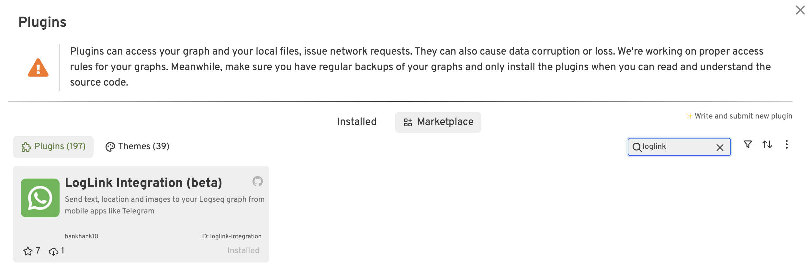
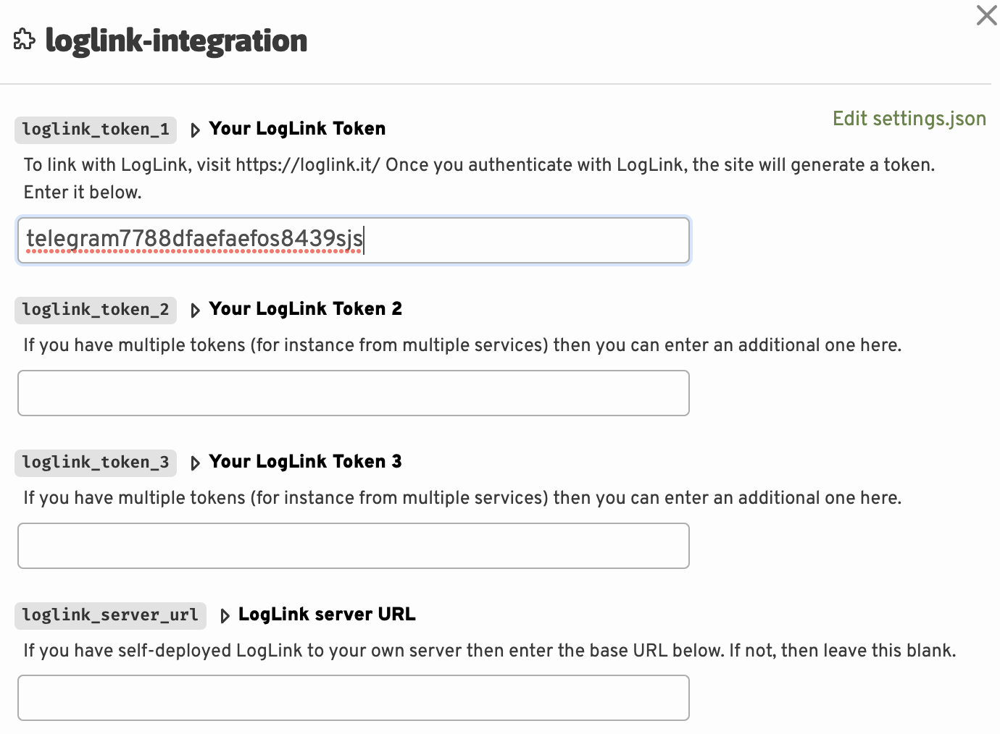

# Download and configure plugin

## Download methods

### Download from Logseq Marketplace

Go to the **Logseq Plugin Marketplace** in the desktop app and search for LogLink. Click on the plugin and then click the "Install" button.

{ width=600}

## Configure the plugin

Choose the :material-cog: cog icon and choose **Plugin settings**.

Insert the token that you were sent by the bot into the first box here. If you are only using one bot, you can leave the second and third box empty. The first box always needs to be populated.

{ width=600 }

Assuming you are not running your own server, you can leave the last box empty.

