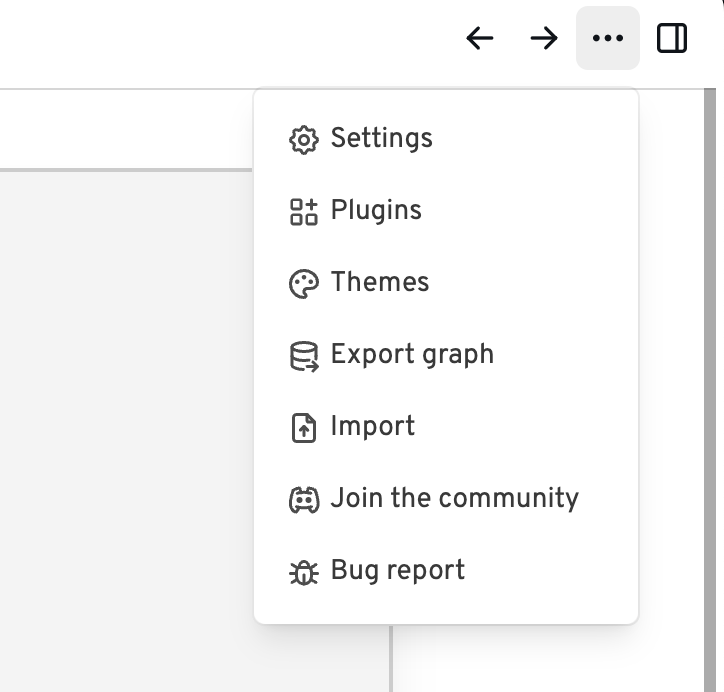
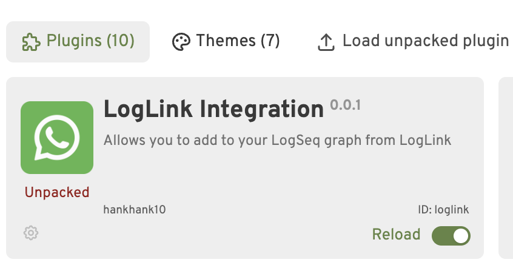

# Download and configure plugin

## Download methods

### Via the LogSeq marketplace

While the plugin is in alpha, the plugin is not yet available from the marketplace.

### Download from Github

During the alpha period, the plugin must be downloaded manually from [Github](https://github.com/hankhank10/loglink-plugin/).

[Download latest version :fontawesome-brands-github:](https://github.com/hankhank10/loglink-plugin/archive/refs/heads/main.zip){ .md-button }

Unpack the downloaded zip file into a directory of your choice (desktop is fine if you like).

Open LogSeq and go to the settings menu:

{ width=300 }

Open **Logseq→Settings→Advanced**, and enable developer mode.

Open **Logseq→Plugins**, choose :octicons-upload-16: **Load unpacked plugin**, and select the location where you unzipped the source code.

You should now see the plugin in the list of plugins:

{ width=600 }

## Configure the plugin

Choose the :material-cog: cog icon and choose **Plugin settings**.

Insert the token that you were sent by the bot into the first box here. If you are only using one bot, you can leave the second and third box empty. The first box always needs to be populated.

{ width=600 }

Assuming you are not running your own server, you can leave the last box empty.

