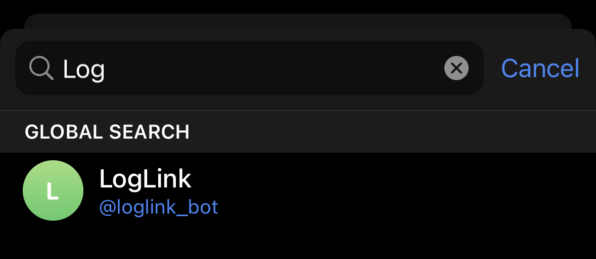
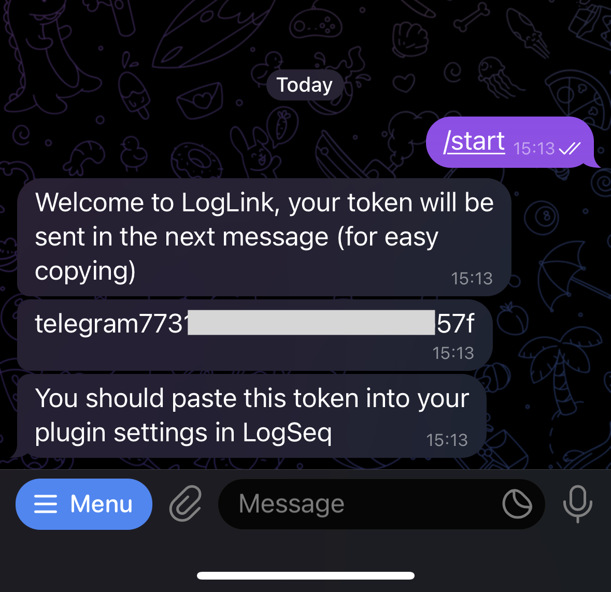
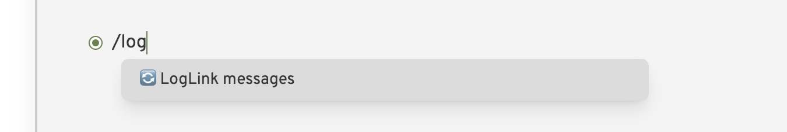

# Telegram Quickstart

Telegram is the preferred client to use for LogLink. It has a slick bot interface and does not charge usage costs for the server.

## Step 1: Understand the risks

!!! danger "Danger zone"

    Before you do anything you should read and understand the important [security notice](/security-notice) - LogLink is not suitable for everyone!

## Step 2: Get a beta code

LogLink is currently in a closed testing phase and as such you won't be able to sign up without a beta code.

If you are interested in supporting the project by acting as an alpha tester, then please sign below.

[Sign up for beta](https://form.jotform.com/230035811319043){ .md-button }

## Step 3: Download Telegram and create an account

[Download Telegram](https://telegram.org/apps) and install it on your phone.

## Step 4: Find the LogLink bot

[Click here to message the bot :fontawesome-brands-telegram:](https://t.me/loglink_bot){ .md-button }

or open Telegram and search for the LogLink bot:

{ width=300 }

## Step 4: Start the bot with your beta code

Message the bot with the following command:

```
/start yourbetacode
```

(obviously replacing `yourbetacode` with the code you were sent when you were invited to the beta)

## Step 5: Get the token

Assuming the beta code is recognised, you will receive a token from the bot, which will look something like `telegram11223344aabbccddee11`.

!!! danger "Your token is secret"

    This token allows access to any future messages you send to the bot. Do not share it with anyone.

    If you believe your token is compromised then you should [refresh it](/refresh-token).

You can copy this token by pressing and holding on the message.

{ width=300 }

## Step 5: Download and configure the LogLink plugin

[Follow the instructions here to download and configure the LogLink plugin](/setup-plugin)

## Step 6: Send messages to the bot via Telegram

Send a test message to the bot via Telegram:

{ width=300 }

Then go to LogSeq and insert the result into your graph using the slash command `/loglink`:

{ width=600 }

It will download the message and insert it into your graph:

{ width=600 }


